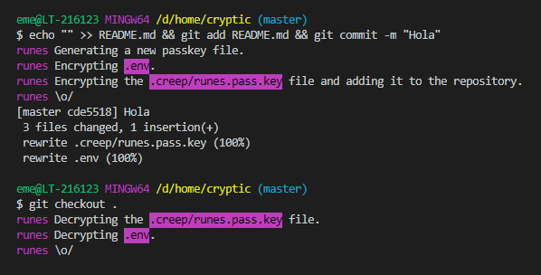

# creep
Creep, a Git's buddy.

A small toolkit for Git to ease a developer's everyday life.

### Usage
Add it as a git submodule to your project:
```Shell
git submodule add https://github.com/x1n13y84issmd42/creep.git

# When cloning a project which references a submodule:
git submodule init
git submodule update
```

Also make a directory for creep's stuff in the root of your project:
```Shell
mkdir .creep
```

## Runes
Runes is a tool to automatically and transparently encrypt and decrypt sensitive files on commits, clones & checkouts. Now you can keep your tokens in the repo safely.



### Usage
You'll need two git hooks in your project, `pre-commit` & `post-checkout`. You can use the ones from the `runes/.githooks` folder and copy them over to the `.git/hooks` directory in your project.

Also you'll need keys, so generate them from your project root directory:
```Shell
creep/runes/keygen
```

And a list of sensitive files to encrypt before commiting them to git:
```Shell
echo ".env" > .creep/.runes
echo "config/secrets.json" >> .creep/.runes
```

And you're set for keeping private data in git. Just go on adding files, commiting & pushing as usual, Runes will take care about the privacy. The files from the `.creep/.runes` list are now encrypted and decrypted as you go.

The `.creep/runes.private.key` file is gitignored, so take some care about it, so it won't get lost or something, otherwise you won't ever read your precious files again, y'know.

## TODO
* [ ] A warning message to keep the `.creep/runes.private.key` file in `creep/runes/keygen.sh`;
* [ ] `runes.diff`, a check for the decoded files change - in `pre-commit` first encrypt the files with the old version of the passkey file, check `git diff`, in case there is difference - reencrypt it with a new passkey as usual.
