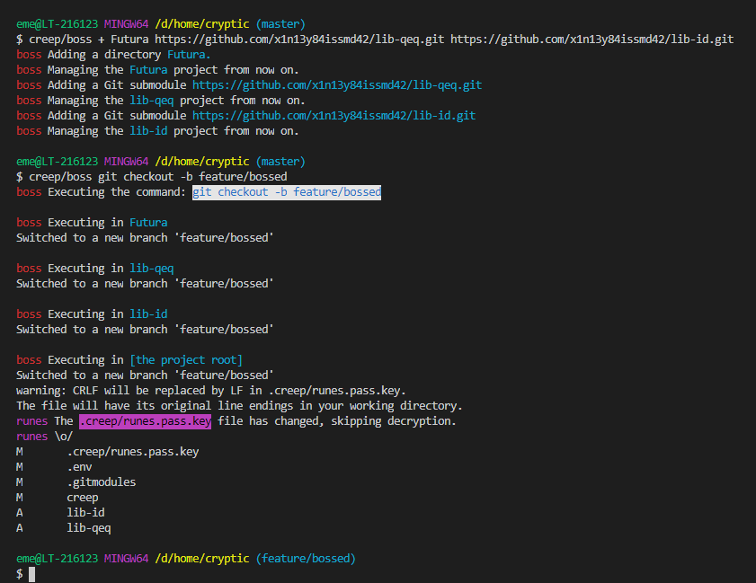

# creep
Creep, a Git's buddy.

A small toolkit for Git to ease a developer's everyday life.

Consists of
* [Runes](#runes) &mdash; encrypting sensitive files on the go.
* [Boss](#boss) &mdash; managing multiple repositories.
* [Git](#git) &mdash; Git utilities and useful commands.

### Usage
Add it as a git submodule to your project:
```Shell
git submodule add https://github.com/x1n13y84issmd42/creep.git

# When cloning a project which references a submodule:
git submodule init
git submodule update
```

Also make a directory for creep's stuff in the root of your project:
```Shell
mkdir .creep
```

# Runes
Runes is a tool to automatically and transparently encrypt and decrypt sensitive files on commits, clones & checkouts. Now you can keep your tokens in the repo safely.


### Usage
In order for Runes to work, you'll need hooks. Runes can install them for you:
```Shell
creep/runes install-hooks
```

Also you'll need keys, so generate them from your project root directory:
```Shell
creep/runes keygen
```

And a list of sensitive files to encrypt before commiting them to git:
```Shell
creep/runes secure .env
creep/runes secure config/secrets.json
creep/runes secure keys/veryprivate.key
```

And you're set for keeping private data in git. Just go on adding files, commiting & pushing as usual, Runes will take care about the privacy. The files from the `.creep/.runes` list are now encrypted and decrypted as you go.
 
> :eggplant: The `.creep/runes.private.key` file is gitignored, take some care about it so it doesn't get lost or something, otherwise you won't ever read your precious files again, y'know.

### Configuration

|Parameter|Decription|Values|
|-|-|-|
|`CREEP_RUNES_LOG`|Controls the logging verbosity. Set it to `0` to disable logging.|0—3
|`CREEP_RUNES_OFF`|Disables Runes altogether.|1

# Boss

A tool to execute arbitrary commands in parallel in a set of directories under it's management, or, in other words, a command demultiplexing tool. Attempts to simplify control over microservice architectures and other complex projects.

Use it to manage multiple repositories with fewer commands and automate other tasks over bulks of files.



### Usage
First, add a directory under the Boss' management. It can be either a simple directory or a Git repository URL:
```
creep/boss + DirOne Folder2 https://github.com/microsoft/TypeScript.git
```
This will add `TypeScript` as a git submodule to the project and start tracking all three folders. Boss will automatically commit the changes it makes during this operation.

Assuming `DirOne` & `Folder2` are Git working copies as well, now you can run:
```
creep/boss git checkout -b bossed/totally
```
This executes `git checkout -b bossed/totally` in all three folders and essentially switches all the projects to new identically named branches.

Arbitrary CLI commands are possible.

If you want to use redirections `>` & `>>`, quote your command line:
```
creep/boss "echo '## Bossed!' >> README.md && git commit -am 'Hola'"
```

# Git
A set of Git utilities and useful commands of all kinds.

### submodule purge
Attempts to completely remove a Git submodule. Requires a clean working tree beforehand and afterwards (i.e. commit everything after you've executed it).
```
creep/git submodule purge useless-submodule-name
```
